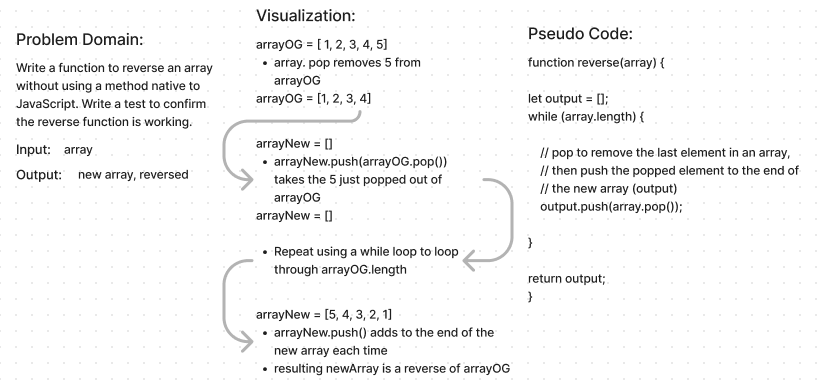
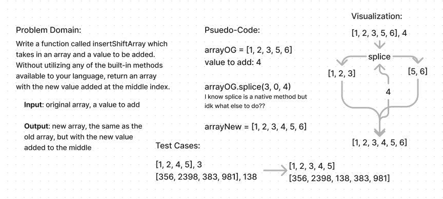
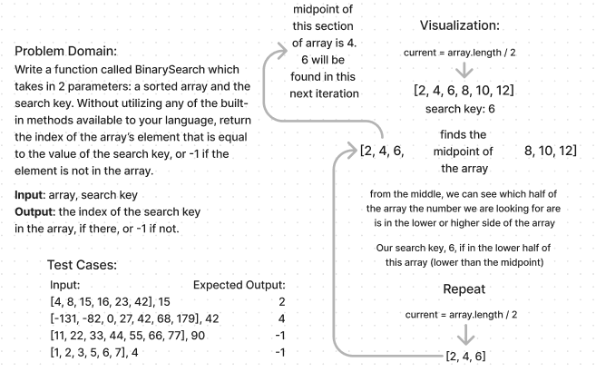
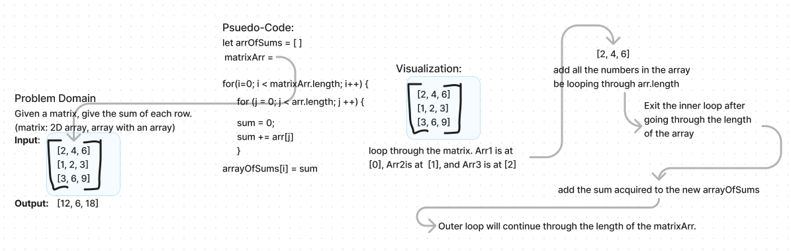
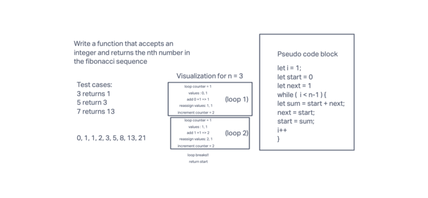

# Data Structures and Algorithms

## 401 Data Structures, Code Challenges

# Array-Reverse
Reverse an array without using native .reverse() method.

## Whiteboard Process

## Approach & Efficiency
whiteboarding a problem is very new to me, so this challenge for this assignment was to reference the whiteboard template and try to format mine in the same way. Not knowing much about Big O right now or how to calculate it yet, I left that part (and some others that didn't seem applicable to me at the time) out of my whiteboarding for this assignment.

## Solution
This code did not need to be run or tested for the assignment today, it was a whiteboard challenge only.

# Array-Insert-Shift
Add a value to the middle on an array without using native JavaScript methods

## Whiteboard Process

## Approach & Efficiency
I could not find a solution to this without using a native method so I just used .splice(). Since this is a whiteboarding assignment per the instructions, I used this opportunity to practice my whiteboarding skills rather than wracking my brain trying to re-write .splice(). I will update this after code review tomorrow, when I will hopefully know how to complete the actual challenge.

## Solution
This code did not need to be run or tested for the assignment today, it was a whiteboard challenge only.

# Binary-Search
Add a value to the middle on an array without using native JavaScript methods

## Whiteboard Process

## Approach & Efficiency
Read about binary search in the documentation provided by the code challenge, and did my best to implement when I leared.

## Solution
This code did not need to be run or tested for the assignment today, it was a whiteboard challenge only.

# Technical Interview I
I worked with Nate to perform a mock interview. I completed a challenge that took in a given matrix and then found the sum of each array in the matrix, returning the in a new array. Nate took on a challenge to find the nth number in the Fibonacci sequence and return the value of it.

## Whiteboard Process

## Approach & Efficiency
Nate and I helped each other out with the challenges, though I think he was a better help to me than I was to him. It really helped for me to be able to talk through my thought process with someone.

# Technical Interview II
I worked alone, lacking an interviewer. I completed both challenge, though the second one is still buggy. The first challenge was to reverse a linked list without using native methods, and the second challenge was to verify whether or not a linked list is a palindrome.

## Whiteboard Process

## Solution
I think that my code for the reverse list challenge would work in a real-life scenario. However, my solution to the verify palindrome challenge has no many holes in the logic and would not work in the real world.

# Technical Interview III
I worked with Jonathan and Daniel for this whiteboard interview. I interviewed both Daniel and Jonathan, and Jonathan interviewed me. My challenge was to write a function called maxStack() that returns the node with the max value within the stack. Daniel had to write a duckDuckGoose() function that loops through a linked list of names, removing the Kth node from the list until there is onle one node remaining. Jonathan worked on last week's problem of verifying whether or not a linked list is a palindrome.

## Whiteboard Process

## Approach & Efficiency
First of all, interviewing Jonathan while he worked through the problem that was giving me trouble last week was very helpful to me. I know a few ways I can fix my original solution to make it functional. Secondly, I recieved feedback from Jonathan during my interview about talking through my proposed solution at the beginning of the interview, before diving in to write code.

## Solution
I am confident my code will work, I feel as though I was able to catch the edge cases and make any needed adjustments to my code as I went.
