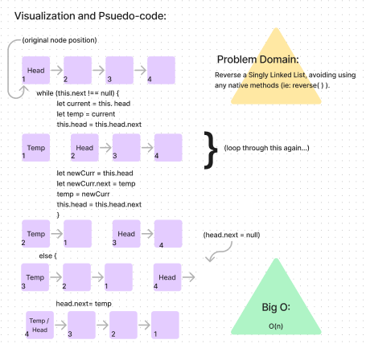
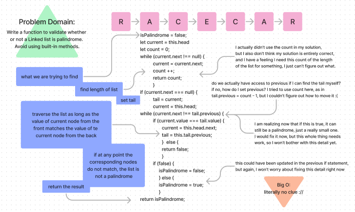
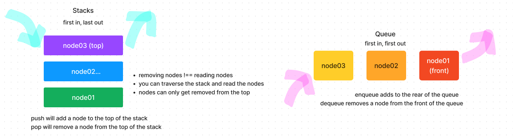
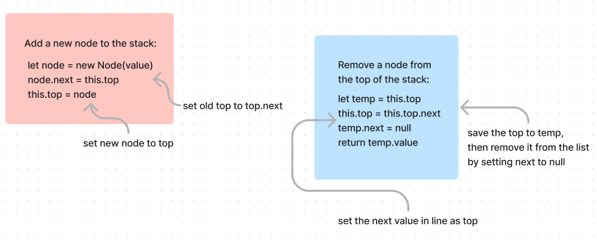
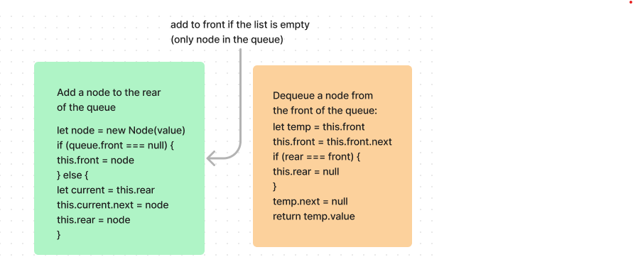

# Linked Lists

## Notes and Whiteboarding:

### Linked Lists

### Stacks and Queues

### References:

* <https://www.geeksforgeeks.org/javascript-program-for-inserting-a-node-in-a-linked-list/>
  * Helped add a node to the front of the linked list

* <https://stackoverflow.com/questions/41646068/linked-list-contains-function-returns-false-why-javascript>
  * Helped with the includes method on linked

* <https://www.techiedelight.com/find-kth-node-from-the-end-linked-list/>
* <https://dev.to/akhilpokle/remove-nth-node-from-the-end-of-a-linked-list-solving-a-paypal-interview-question-47i>
  * Helped with the kthFromEnd function
